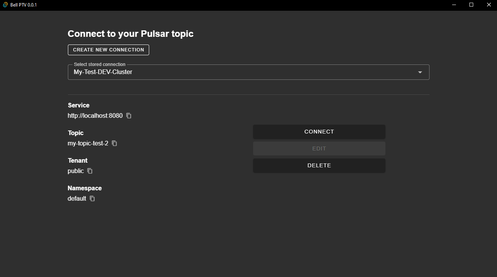

<h1>Pulsar Topic Viewer (PTV)</h1>


Connect to your Apache Pulsar cluster and analyze your topic statistics while connected.


---
**Website**: <a href="https://mauricekuenicke.github.io/pulsar-topic-viewer/" target="_blank">https://mauricekuenicke.github.io/pulsar-topic-viewer/</a>
**Source Code**: <a href="https://github.com/MauriceKuenicke/pulsar-topic-viewer" target="_blank">https://github.com/MauriceKuenicke/pulsar-topic-viewer</a>

---


<p align="center">
    <em>Store and manage your topic connections</em>
</p>


<p align="center">
    <em>Create and test new connections</em>
</p>

# Development
## Pulsar Basic Auth Setup
We create a superuser with the password 'admin' for development purposes on our local pulsar-standalone cluster .
Copy the content of `_dev/pulsar_config/basicAuth` into your mounted volume where the pulsar configuration
lives (`/pulsarconf/_data`). If using Docker Desktop under Windows, you can find your volumes here:
```
\\wsl$\docker-desktop-data\version-pack-data\community\docker\volumes
```
Just copy this path into your file explorer. You can adjust the credentials if needed by
providing a different `.htpasswd` file. Make sure to also adjust the credentials in the config file
to let the proxy connect to the broker correctly.

